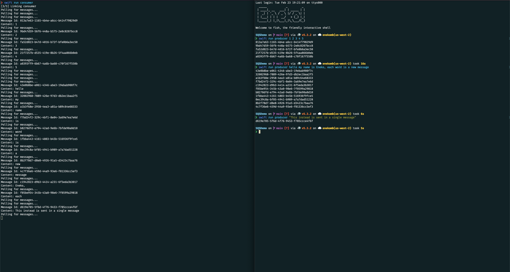

# SQSDemo

An example of an AWS SQS producer and consumer application written in Swift.




## Producer

The producer cli takes arguments from the command line to send messages:

```swift
import SotoSQS

let arguments = ProcessInfo.processInfo.arguments
guard arguments.count > 1 else {
    print("Nothing to send")
    exit(0)
}

let client = AWSClient(httpClientProvider: .createNew)
defer { try? client.syncShutdown() }
let sqs = SQS(client: client, region: .uswest2)
let queue = "https://sqs.us-west-2.amazonaws.com/<account>/sqs-swift-demo"

for message in arguments.dropFirst() {
    let input = SQS.SendMessageRequest(messageBody: message, queueUrl: queue)
    let result = try sqs.sendMessage(input).wait()
    print(result.messageId ?? "[No id]")
}
```

## Consumer

The consumer cli loops forever, waiting for messages to arrive.

```swift
import SotoSQS

let client = AWSClient(httpClientProvider: .createNew)
defer { try? client.syncShutdown() }
let sqs = SQS(client: client, region: .uswest2)
let queue = "https://sqs.us-west-2.amazonaws.com/<account>/sqs-swift-demo"

// Poll for messages, waiting for up to 10 seconds
let request = SQS.ReceiveMessageRequest(queueUrl: queue, waitTimeSeconds: 10)

// Fetch messages forever, until interrupted or terminated
while true {
    print("Polling for messages...")
    let result = try sqs.receiveMessage(request).wait()
    for message in result.messages ?? [] {
        print("Message Id:", message.messageId ?? "[no id]")
        print("Content:", message.body ?? "[no message]")

        if let handle = message.receiptHandle {
            let deleteRequest = SQS.DeleteMessageRequest(queueUrl: queue, receiptHandle: handle)
            _ = try sqs.deleteMessage(deleteRequest).wait()
        }
    }
}
```

